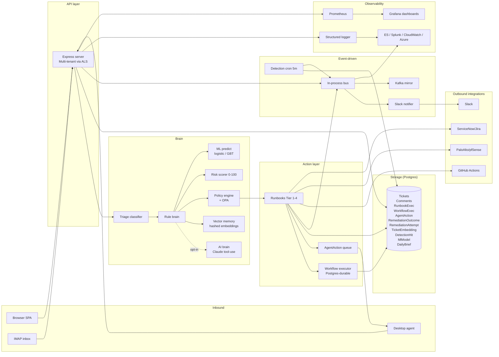
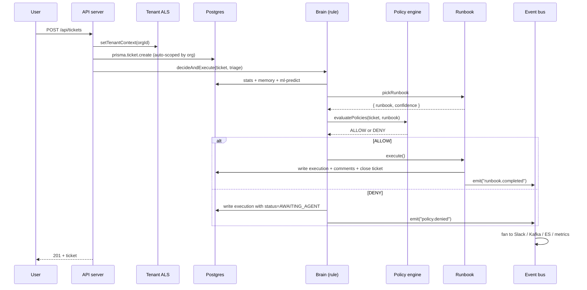
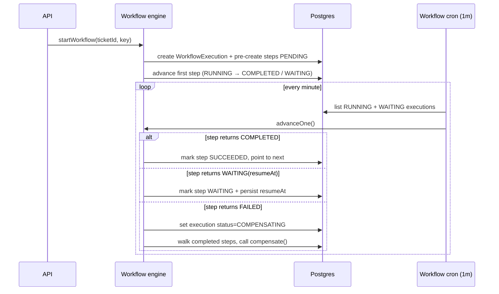
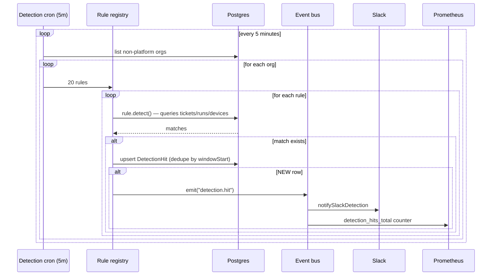
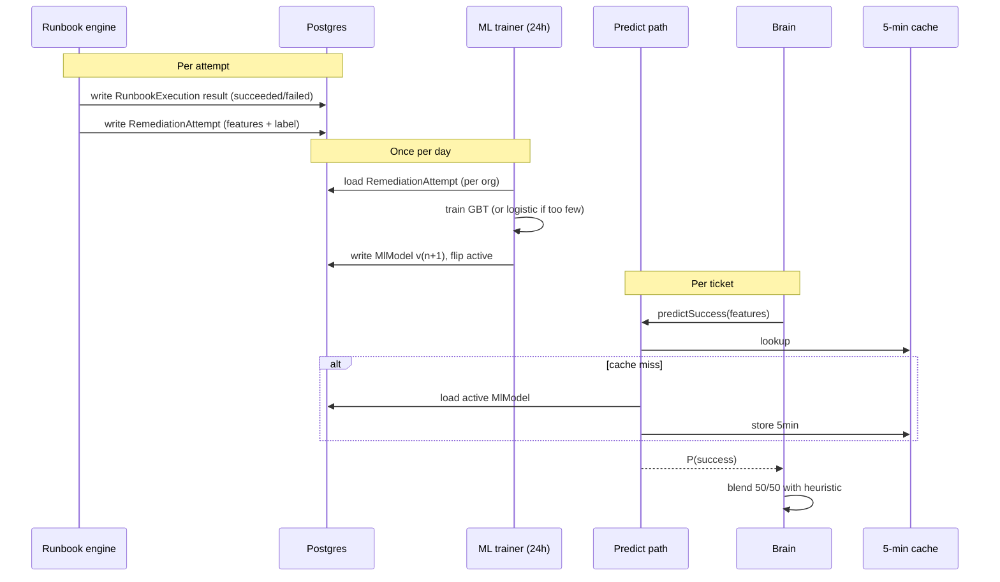

# Relay — system architecture

The complete architectural picture, including how Phases 1-24 fit
together. Use this as the new-engineer onboarding doc.

## High-level system diagram

## Request lifecycle — ticket creation

## Workflow lifecycle — multi-step plan

## Detection cycle

## ML loop

## Data store map

| Table | Purpose | Phase |
|---|---|---|
| Organization | Tenant root | 6 |
| User, OrgInvite | Identity | 1, 6 |
| Ticket, Comment, Attachment | Core ticketing | 1 |
| SurveyResponse | Post-resolution CSAT | 3 |
| Device, DeviceMetric, AgentEnrollmentToken | Endpoint fleet | 7 |
| KbArticle | Self-service KB | 2 |
| ServiceComponent, Incident | Status page | 4 |
| RunbookExecution | Tier 1-4 audit | 10A |
| RemediationOutcome | Aggregate learning counts | 10B |
| AgentAction | Tier 2 agent dispatch | 10C |
| TicketEmbedding | Vector memory | 11 |
| DailyBrief | Morning summaries | 11 |
| DetectionHit | Sigma-style detection log | 12 |
| WorkflowExecution, WorkflowStepExecution | Multi-step plans | 13 |
| MlModel | Versioned learned classifiers | 16 |
| RemediationAttempt | Per-attempt ML training data | 20 |

## Background jobs

| Job | Frequency | Purpose |
|---|---|---|
| Autopilot | 1 min | settleVerifications + retry stuck tickets |
| Workflow advancer | 1 min | drive RUNNING/WAITING workflow steps |
| SLA scanner | 5 min | flag tickets past SLA, notify agents |
| Detection | 5 min | run all 20 rules per org |
| Daily brief | 24h (08:00) | generate per-org Markdown brief |
| ML trainer | 24h (03:00) | train classifier from RemediationAttempt |
| IMAP poller | configurable | pull inbound email into tickets |

## Boundaries — what's NOT in Relay

- **Identity provider** — we accept Google / Microsoft / local; we don't
  *be* an identity provider.
- **Endpoint protection** — the agent reports telemetry + dispatches
  actions; it doesn't replace MDM / EDR.
- **Ticket queue substitution** — we ARE the queue; we don't shim into
  ServiceNow / Jira. The ITSM integrations push out, they don't replace.
- **SIEM** — we have detection but we don't ingest raw logs at scale; for
  that pair us with Splunk / Elastic SIEM via the log sinks.
