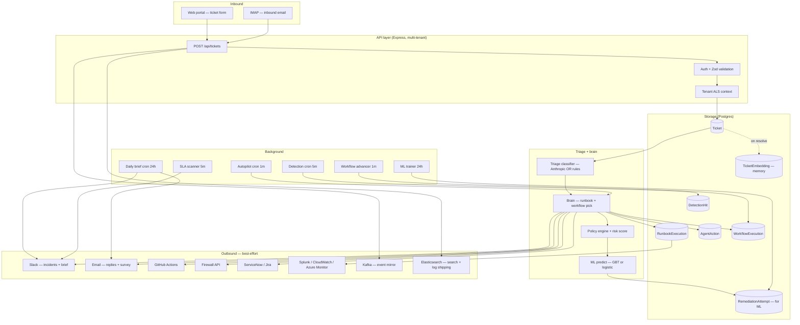

# Relay — data flow diagram

The high-level data flow from inbound ticket → outbound action. Use this
as the answer to an auditor's "what happens when a ticket lands?" question.

## Data classification

| Data | Class | Where it lives | Retention |
|---|---|---|---|
| User name + email | PII | `User` table | until org deletes the user |
| Password hash | secret | `User.passwordHash` (bcrypt) | until rotation |
| Ticket description | potentially-PHI | `Ticket.description` | configurable; default indefinite |
| OAuth tokens | secret | env vars / secrets manager | until rotation |
| Vendor API tokens | secret | env vars / secrets manager | until rotation |
| ML model weights | non-sensitive | `MlModel.weights` JSON | last 5 versions kept |
| Detection evidence | metadata + PHI references | `DetectionHit.evidence` JSON | 90 days recommended |
| Audit logs (comments) | metadata | `Comment` | indefinite (this is the audit trail) |
| Telemetry metrics | non-sensitive | Prometheus → external | per environment |
| External-system logs | as-emitted | Splunk / CW / Azure | per environment retention |

## Cross-border flow considerations

- If your customer's data class is "EU PII", the Anthropic API call from
  the brain crosses the Atlantic. Document this in your DPA. Mitigation:
  set `USE_AI_BRAIN=false` (the rule brain runs entirely on-cluster) or
  use Anthropic's EU endpoint if available.
- Slack webhooks: data is sent to whatever Slack region the org's
  workspace lives in.
- CloudWatch / Azure Monitor / Splunk: data crosses to whichever region
  the customer's vendor account is in. Document.
